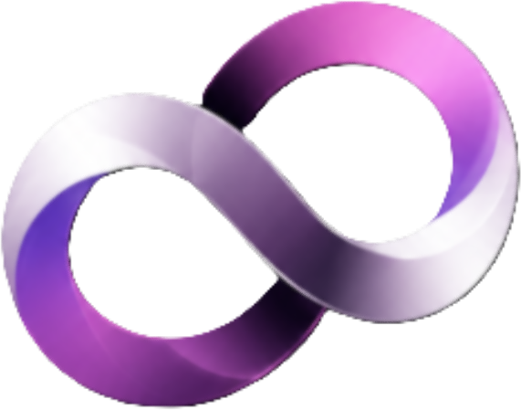

<div align="center">



# ✨ CocoAI

### *Your Invisible Real-Time Interview Copilot — Undetectable. Instant. Flawless.*

[](https://electronjs.org)
[](https://vitejs.dev)
[](https://react.dev)
[](https://tailwindcss.com)
[](LICENSE)

**A state-of-the-art, screen-share invisible AI technical interview assistant overlay designed to act as your ultimate real-time coding and communication copilot.**

[📖 Core Features](#-core-features) · [📥 Download Installer](#-getting-started) · [🐛 Report Bug](https://github.com/Hey-Astreon/COCO-AI/issues) · [💡 Request Feature](https://github.com/Hey-Astreon/COCO-AI/issues)

</div>

---

## 🌊 Live Preview & Aesthetics

CocoAI features a **premium glassmorphism UI system** with deep purple and cosmic violet hues (`#8b5cf6` Electric Violet, `#ec4899` Laser Fuchsia, `#07070c` Obsidian). It floats on top of your screen as a hardware-protected overlay that is **physically invisible** to Zoom, Discord, Google Meet, MS Teams, and proctoring screen shares.

*   **⚡ Streaming Answers:** Character-by-character solutions appearing in under **200ms** (powered by Cerebras LPU & Groq).
*   **🎙️ Smart STT Transcription:** High-accuracy real-time speech tracking with accented audio tolerance via Deepgram Nova-3.
*   **📐 Adaptive Stealth Layouts:** Instantly cycle between `Full Dual-Pane`, `Compact Tabs`, and `Ghost Click-Through` modes.
*   **🌊 Dynamic Audio Level Meter:** Three-bar active voice amplitude meter embedded directly in the toolbar.

---

## ⚡ Core Features

### 🧠 Triple-Engine AI Answer Streaming
*   **Primary Engine (Cerebras LPU):** Super-speed answer generation using Cerebras LPU architecture (up to 2,000 tokens/sec) for Llama-3.3-70b, Llama-3.1-8b, and Qwen-3-32b.
*   **Groq Auto-Fallback:** An automatic, silent fallback pipeline. If Cerebras rate-limits or goes down, your Groq API key seamlessly picks up the request with zero interruption.
*   **STT Phonetic Error Tolerance:** Prompt instruction filters that understand and correct phonetic transcript errors (e.g., automatically resolving "reactive native" to "React Native" or "usestate hook" to "useState hook") without mentioning the typo.

### 🎙️ CD-Quality Live Transcription (Deepgram Nova-3)
*   **High-Fidelity Loopback:** Uses WASAPI loopback audio to record interviewer speech directly from system output (avoiding micro-microphone loops).
*   **Calm Conversational Debounce:** Increased silence checks (`utterance_end_ms` set to 3s and `endpointing` set to 1.5s) ensure CocoAI calmly listens to the entire question and waits for the interviewer to finish speaking instead of triggering early.
*   **Realtime Audio Meter:** Three glowing wave bars react dynamically to voice volume directly in your toolbar.

### 🛡️ Hardware-Level Stealth Protection
*   **Zero Leak Screen-Share Protection:** Enforced via Electron's `setContentProtection(true)` Win32 hook, blocking all software recorders, desktop screenshots, and screen-sharing programs from seeing the window.
*   **Custom Form Dropdowns:** Replaced standard HTML/OS select tags with custom-rendered, protected overlay components to prevent system popups from popping through onto Zoom screen shares.
*   **Stealth Profiles:**
    *   `Full` (850px): Dual-pane layout showing Answers & Transcript side-by-side.
    *   `Compact` (580px): Tabs interface showing one panel at a time with notification glow badges.
    *   `Ghost`: Fully transparent window with click-through enabled. Hovering over the stealth toggle lets you control it while ignoring clicks elsewhere.

### 📸 Multi-Screenshot Screen Solver (`Ctrl + Shift + S`)
*   **Scroll Capture Buffer:** Don't get limited by scrollable or long programming problems.
*   **How it works:** Use `Ctrl+Shift+S` to capture different sections of a problem as you scroll. They accumulate in a buffer.
*   **Context Fusion:** Press `Ctrl+Shift+A` to solve the entire problem using the combined buffer of screenshots (processed via Gemini 2.0 Flash or NVIDIA NIM minimax-m3 fallback).

### 📑 1-Click Post-Interview Exporter
*   **Instantly save your sessions:** Extract all transcribed speech, coding blocks, timestamps, and AI solutions directly to clean Markdown (`.md`) or structured JSON with a single click.

---

## ⌨️ Keyboard Shortcuts

| Shortcut | Action |
|---|---|
| `Ctrl + Shift + H` | Toggle Overlay visibility |
| `Ctrl + Shift + A` | Screen capture & analyze (Fresh Start) |
| `Ctrl + Shift + S` | Add current screen to multi-screenshot buffer (Scroll Solver) |
| `Ctrl + Shift + G` | Cycle Stealth Profiles (`Full` ➔ `Compact` ➔ `Ghost`) |
| `Ctrl + Shift + P` | Panic (Instant window hide & state safety lock) |
| `Alt + ← / →` | Move window position to Left / Right screen edge |
| `Enter` | Submit written question from input bar |
| `Escape` | Focus input bar / Clear focus |

---

## 🚀 Getting Started

### Prerequisites
Make sure you have [Node.js](https://nodejs.org) (v18+) installed on your system.

### Installation
1. Clone this repository:
   ```bash
   git clone https://github.com/Hey-Astreon/COCO-AI.git
   cd COCO-AI
   ```
2. Install dependencies:
   ```bash
   npm install
   ```
3. Set up your API Keys inside a `.env` file in the root directory:
   ```env
   CEREBRAS_API_KEY=your_cerebras_key
   DEEPGRAM_API_KEY=your_deepgram_key
   GEMINI_API_KEY=your_gemini_key
   GROQ_API_KEY=your_groq_key
   BUILD_NVIDIA_API_KEY=your_nvidia_key
   ```
4. Start the desktop application:
   ```bash
   npm start
   ```
5. Build the Windows installer (`.exe`):
   ```bash
   npm run build
   ```

---

## 🗂 Project Structure

```
COCO-AI/
├── assets/
│   ├── coco_logo_nobg.png      # High-resolution transparent CocoAI brand logo
│   └── coco_logo.ico           # Windows application icon
├── main.js                     # Electron main process (stealth hooks, hotkeys, capture logic)
├── preload.js                  # Secure IPC bridge interface
├── index.html                  # Main application structure & toolbar
├── style.css                   # Cosmically styled dark glassmorphism system
├── app.js                      # UI controller, local uploader, and state machine
├── services/
│   ├── deepgram.js             # Nova-3 Audio socket and loopback mixer
│   ├── cerebras.js             # Cerebras dynamic Llama stream provider
│   ├── groq.js                 # Groq versatile fallback Llama/Qwen provider
│   ├── gemini.js               # Gemini 2.0 Flash vision screen solver
│   └── nvidia.js               # Nvidia integrate API vision solver
└── website/Landing Page/       # Modern React 19 + Vite + Tailwind CSS v4 Landing Page
```

---

## 🛡 Security & Privacy

*   **100% Client-Side Context Processing:** Your PDF resumes and Job Descriptions are parsed locally inside your browser thread using `PDF.js` and cached in `localStorage`. Nothing is stored on third-party servers.
*   **Direct API Connections (BYOK):** All AI queries are sent directly from your computer to the model providers (Cerebras, Groq, Google, Nvidia) using your own API keys. No middleware servers can log your transcripts.

---

## 📊 Competitor Comparison

| Copilot Tool | Screen Protection | Multi-AI Fallback | Offline PDF Parsing | Coding Solves | Accented STT |
| :--- | :---: | :---: | :---: | :---: | :---: |
| **CocoAI** | **✅ Yes (DirectX)** | **✅ Yes (Cerebras+Groq)** | **✅ Yes (PDF.js)** | **✅ Yes** | **✅ Yes (Nova-3)** |
| Cluely | ❌ No | ❌ No | ❌ No | ❌ No | ❌ No |
| Parakeet AI | ❌ No | ❌ No | ❌ No | ❌ No | ❌ No |
| Chiku AI | ❌ No | ❌ No | ❌ No | ❌ No | ❌ No |
| Mindwhisper AI | ❌ No | ❌ No | ❌ No | ❌ No | ❌ No |

---

## 👩‍💻 Development Authors

*   **Roushan Kumar (Founder & Lead Architect)** — [@Hey-Astreon](https://github.com/Hey-Astreon) · [Astreon.me](https://Astreon.me)
*   **Ayushi Raj (Co-Developer & UX Lead)** — [@Silenttears-cloud](https://github.com/Silenttears-cloud) · [Ayushiraj.me](https://Ayushiraj.me)

*Full-Stack Developers · AI Orchestrators & Product Architects*

> *"Every system has a vulnerability. We build better."*

---

## 📄 License

This project is licensed under the **MIT License** — see the [LICENSE](LICENSE) file for details.

---

<div align="center">

**Built with 💜 by Roushan & Ayushi**

*If CocoAI helped you ace your interviews, give it a ⭐ on GitHub!*

</div>
