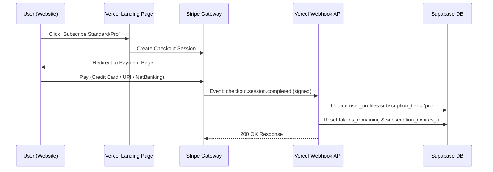

# CocoAI Subscriptions & Licensing Architecture Plan

We need to add authentication, subscription tiers, and payment authorization to CocoAI **without breaking the existing software**. To do this, we propose a **Hybrid Architecture** that keeps current direct-key settings functional while offering a zero-configuration Premium Cloud mode for paying subscribers.

---

## 🛠️ Hybrid Product Strategy

```
                          ┌───────────────────────────┐
                          │    CocoAI Desktop App     │
                          └─────────────┬─────────────┘
                                        │
                 ┌──────────────────────┴──────────────────────┐
                 ▼                                             ▼
       [Self-Hosted Mode]                             [Premium Cloud Mode]
   - Direct client API calls                     - Authenticates with Supabase Auth
   - User inputs their own keys                  - Routes requests through our Vercel API
   - Free (uses their own quotas)                 - Standard: 29 INR/mo · Pro: 299 INR/mo
```

1. **Self-Hosted Mode (Current Behavior):** Users can paste their own Cerebras, Groq, Gemini, and Deepgram API keys in Settings. Calls go directly from the client to the providers. Free, no subscription required. This ensures the app is 100% stable and open-source friendly.
2. **Premium Cloud Mode (New Option):** Users sign in with a CocoAI account (Google Auth or Email). No developer API keys are required. All LLM and transcription requests are securely routed through our Vercel Serverless proxy endpoints using our master keys. Usage is metered against their token/minutes quota.

---

## 🔒 User Authentication & Database Schema

We will use **Supabase Auth** (already configured on the Vercel landing page) to manage user credentials, registration, and database records.

### Database Tables (Supabase)

#### 1. `public.user_profiles` (Extends Supabase `auth.users`)
Tracks user roles, billing tiers, and usage quotas.
```sql
create table public.user_profiles (
  id uuid references auth.users on delete cascade primary key,
  email text not null,
  subscription_tier text default 'free' check (subscription_tier in ('free', 'standard', 'pro')),
  tokens_remaining bigint default 50000, -- Free tier gets 50k initial tokens
  minutes_remaining double precision default 30.0, -- Free tier gets 30 mins of Deepgram audio
  stripe_customer_id text,
  stripe_subscription_id text,
  subscription_expires_at timestamptz,
  created_at timestamptz default now()
);

-- Enable RLS (Row Level Security)
alter table public.user_profiles enable row level security;

-- Insert-only profile creator on signup
create or replace function public.handle_new_user()
returns trigger as $$
begin
  insert into public.user_profiles (id, email)
  values (new.id, new.email);
  return new;
end;
$$ language plpgsql security definer;

create trigger on_auth_user_created
  after insert on auth.users
  for each row execute procedure public.handle_new_user();
```

---

## 💳 Billing & Payment Integration (Razorpay / Stripe)

To capture subscriptions at 299 INR/month, we will use **Stripe** or **Razorpay** on the landing page, handling access control via serverless webhooks.



---

## 🖥️ Desktop Application Updates (Renderer Process)

1. **Auth Panel in Settings:** Add a "Subscription" section inside the Settings drawer where users can:
   - Click "Sign In" (opens a secure popup window pointing to `https://coco-ai-copilot.lovable.app/login` to authenticate).
   - View their active tier (`Free`, `Standard`, or `Pro`).
   - View remaining audio minutes and AI answer token meters.
2. **Dynamic Request Router:** Modify LLM and transcription wrappers (`groq.js`, `gemini.js`, `deepgram.js`):
   - **If user is signed in:** Send the audio stream / screen prompt payload to our backend serverless proxy `/api/ai/analyze` and `/api/audio/transcribe` with the user's Supabase JWT in the headers (`Authorization: Bearer <JWT>`).
   - **If user is NOT signed in:** Fall back to direct client API calls using local keys.

---

## ⚡ Backend Serverless Proxy (Vercel API Routes)

We will implement serverless API routes on the Vercel app to handle request proxies, shield master API keys, and decrement tokens.

### Endpoint: `POST /api/ai/analyze`
1. Read `Authorization: Bearer <JWT>` from request header.
2. Validate JWT using the Supabase JWT secret key.
3. Check the user's profile inside `user_profiles`:
   - If subscription is expired or quota is exhausted (`tokens_remaining <= 0`), return `403 Forbidden` ("Quota exceeded. Please upgrade your plan.").
4. Estimate request token length (prompt text + image pixels).
5. Fetch from Cerebras/Gemini using **our secure server-side environment keys**.
6. Stream the response chunks back to the Electron app.
7. Count output tokens, decrement user's `tokens_remaining` in the database, and return.

---

## 📋 Step-by-Step Execution Plan

To prevent regression bugs and keep the desktop app functioning:

### Phase 1: Supabase DB & Landing Page Auth
- [ ] Create the `user_profiles` schema and RLS policies in Supabase.
- [ ] Implement Vercel Login, Sign Up, and User Dashboard pages.
- [ ] Add the Stripe subscription webhook endpoint on the Vercel backend.

### Phase 2: Serverless Proxy API Routes
- [ ] Build `/api/ai/analyze` (proxies Gemini Vision & Cerebras LLM requests, tracks token usage).
- [ ] Build `/api/audio/transcribe` (proxies Deepgram WebSocket/REST audio stream).

### Phase 3: Desktop App Auth Integration
- [ ] Add the "Sign In" overlay button inside Electron's HTML Settings drawer.
- [ ] Implement secure login popup listener in `main.js` that catches the redirects and passes the session JWT to the renderer process.
- [ ] Update `app.js` state to store/load the JWT securely.

### Phase 4: Dynamic Proxy Routing
- [ ] Update `services/gemini.js` and `services/cerebras.js` to inspect the JWT state and route request payloads to the backend API proxy when signed in.
- [ ] Verify that direct-key requests (Self-Hosted mode) still function perfectly when signed out.

---

## 💬 Open Questions & User Review

> [!IMPORTANT]
> 1. **Payment Gateway Choice:** Do you prefer **Stripe** (global standard, supports card/mobile payments) or **Razorpay** (best-in-class for India UPI, NetBanking, and local cards)?
> 2. **Token Meter Limits:** 
>    - For **Standard (29 INR/mo)**, what limits should we set? (e.g., 200k tokens + 60 minutes of audio).
>    - For **Pro (299 INR/mo)**, should it be unlimited or have a generous fair-use policy? (e.g., 5 million tokens + 1,000 minutes of audio).
> 3. **Google Sign-In:** Do you have your Google Client ID ready for Google OAuth config in Supabase?
